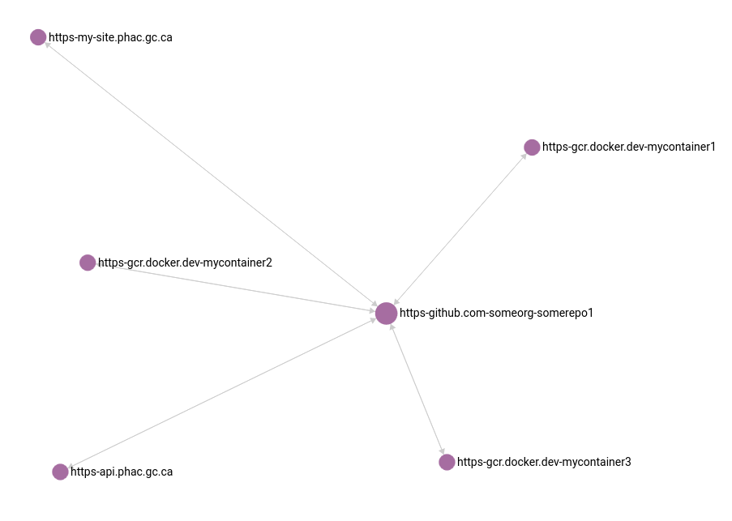

# Graph Updater

## GraphQL Query Examples

The semantics of queries is that a query for any endpoint on a subgraph returns the entire subgraph.

For example, suppose we make the following mutation:

```graphql
mutation {
  endpoints(urls: [
    "https://github.com/someorg/somerepo2",
    "https://another-site.phac.gc.ca",
    "https://some-other-api.phac-aspc.gc.ca"
  ])
}
```

This mutation creates 3 connected enpoints: `https://github.com/someorg/somerepo2`, `https://another-site.phac.gc.ca`, `https://some-other-api.phac-aspc.gc.ca`.

Suppose at a later date, we make some additional associations and attach these endpoints to a product with another mutation:

```graphql
mutation {
  product(
    name: "myproduct"
    urls: [
      "https://github.com/someorg/somerepo2",
      "https://some-other-api.phac-aspc.gc.ca",
      "https://some-third-webapp.phac.alpha.gc.ca"
    ]  
  )
}
```

This mutation adds two additional nodes to the subgraph: `https://some-third-webapp.phac.alpha.gc.ca`, and a product label called `myproduct`. At this point in time, the subgraph looks like the following.



This graph now has the property that a search for *any* endpoint on the graph will return *all* endpoints on the graph. For example, the following graphql query returns the following result:

```graphql
query {
  endpoint(url: "myproduct") {
    url
  }
}
```

```json
{
  "data": {
    "endpoint": [
      {
        "url": "myproduct"
      },
      {
        "url": "https://github.com/someorg/somerepo2"
      },
      {
        "url": "https://some-other-api.phac-aspc.gc.ca"
      },
      {
        "url": "https://some-third-webapp.phac.alpha.gc.ca"
      },
      {
        "url": "https://another-site.phac.gc.ca"
      }
    ]
  }
}
```

Similarly, a GraphQL query for a different vertex on the graph also returns the entire subgraph (although in a different order since the graph traversal started from a different vertex as last time).

```graphql
query {
  endpoint(url: "https://another-site.phac.gc.ca") {
    url
  }
}
```

```json
{
  "data": {
    "endpoint": [
      {
        "url": "https://another-site.phac.gc.ca"
      },
      {
        "url": "https://github.com/someorg/somerepo2"
      },
      {
        "url": "https://some-other-api.phac-aspc.gc.ca"
      },
      {
        "url": "myproduct"
      },
      {
        "url": "https://some-third-webapp.phac.alpha.gc.ca"
      }
    ]
  }
}
```